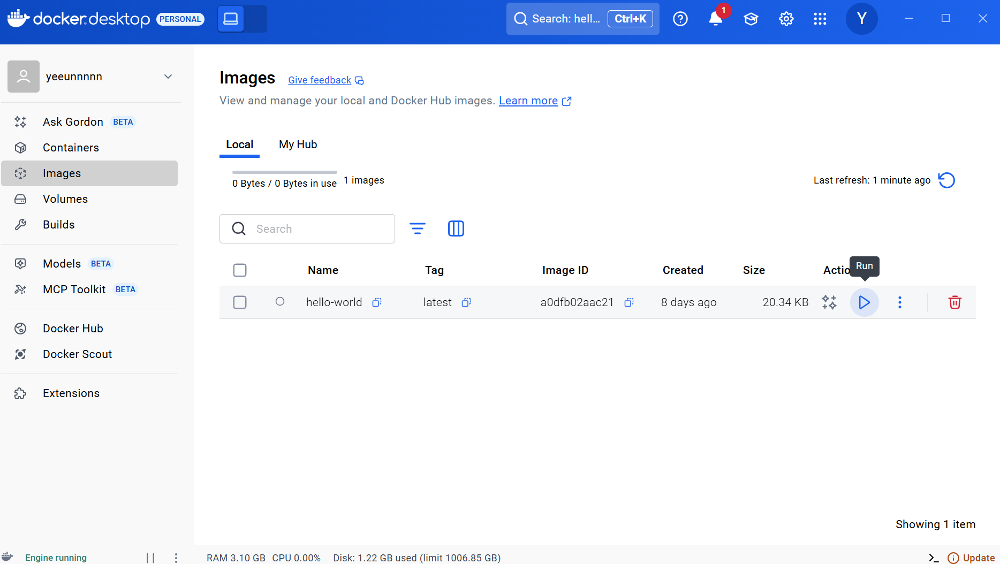

# docker

내 컴퓨터에서 프로그램 실행이 잘된다 해도 os도 다르고 버전도 달라서 오류가 남

그래서 vm이라는 os위에 다른 os를 설치하는건데 무겁도 성능도 안좋아서 생긴게 docker

docker에는 os, sdk, 라이브러리, 필요한 프로그램, 실행한 코드 같은걸 다 밀키트처럼 담을수있음.

그래서 원래 서버 기능을 하나의 프로그램에 다 쑤셔넣었었는데 

이제 각각의 프로그램으로 만듬. msa라고함

도커가 데이터 휘발성도 강함 



설치한 뒤, 위 검색창에서 원하는 팩을 다운 받으면 images 에 저장이 됨.

실행된건 container에서 확인가능. 실행된 컨테이너 하나당 하나의 가상 컴퓨터임 

터미널에서 실행하려면

docker run 이미지이름:Tag(버전) 근데 이렇게 하면 터미널이 점유당해서 다른 명령어를 못침

docker run -d 이미지이름:태그 ← 이렇게 하면 백그라운드에서 실행 됨.

docker run -d -p 내컴퓨터포트:컨테이너포트 ← 이렇게하면 포트 설정이 됨. 필수임

**dockerfile 작성법**

vscode에서 아무 폴더에 Dockerfile 이라는 파일을 만든다

어떤 os, 프로그램, 터미널 명령어, 파일을 사용할건지 다 작성할 수 있음.

**from 명령어** 

from 이미지 ← 특정 이미지에서부터 시작가능. 보통은 os가 설치된 이미지 이름을 적음.

docker hub에서 node 다운 받으면 리눅스에서 node.js가 설치된것임.

버전은 보통 alpine=용량 가장 작은 linux, slim=필요없는 내용지운 Debian linux

**WORKDIR 명령어**

workdir /app ← /app 폴더로 이동하라는 뜻(cd 명령어랑 비슷)

**COPY 명령어**

copy 경로(어떤 파일 옮길지) 경로(어디 이미지로 옮길지)

copy . . ← 이렇게 하면 현재경로에 있던 모든 파일을 이미지의 현재 경로로 복사해줌

복사에 필요없는 파일은 .dockerignore 파일 만들어서 그 안에 파일명 그대로 적으면 됨

**Run 명령어**

run npm install express ← 라이브러리 설치 명령어.

근데 보통은 RUN [”npm”, “install”] 로 하기를 권장. 위에처럼 하면 os에 있는 기본 shell이 이용됨

버전을 안적으면 최신걸로 설치돼서 불안정함. 그래서 package.json을 다른 컴퓨터에 복사하고

npm install 터미널에 입력하면 package.json에 있던 버전으로 라이브러리 설치됨

**EXPOSE 명령어**

expose 8080 ← 8080포트 열어두는 코드, 근데 지워도 영향은 없고 이미지 실행할때 도움말정도.

마지막 터널 명령어는 RUN 말고

**CMD [”node”, “server.js”]** 아니면 **ENTRYPOINT [”node”, “server.js”]**


파일을 다 적었으면 터미널에

docker build 이미지명:태그명(버전) . 

.은 dockerfile의 경로를 적는거라 같은 경로에 있으면 점 찍으면 됨.

여기까지 다 하면 docker에 이미지 추가가 돼서 실행할 수 있음. 이러면 배포 끝임 !

**터미널 도커 사용 명령어**

docker ps = 실행 중인 컨테이너 목록

docker logs 컨테이너명  = 실행중 컨테이너 로그 출

docker exec -it 컨테이너명 sh = 실행중인 컨테이너 접속(그 컴퓨터의 터미널이 열리는 느낌)

ㄴ 나오려면 ctrl + p , ctrl + q 순서대로 입력

docker stop 컨테이너명 = 컨테이너 일시정지

docker rm 컨테이너명 = 컨테이너 삭제

위 명령어 모두 도커 데스크탑에서 편하게 가능.

**성능을 위한 dockerfile 작성법**

- 변동사항이 많은 부분은 밑에 작성하기

(도커가 빌드 작업을 할 때마다 캐싱을 해놔서 빌드가 더 빠름)

- RUN [”npm”, “install”] 보다 RUN [”npm”, “ci”] 로 하면 더 안정적임

(package-lock.json 파일 바탕으로 설치하는 명령어)

- ENV 이름=값,  ex) ENV NODE_ENV=production

(오래전부터 있던  express 같은 nodejs 라이브러리는 production 환경변수를 설정해야 성능이 향상됨)

- USER node ← node라는 유저로 바꾸라는 명령, 기본이 node

(여기는 전부 루트권한이라 코드 실행 전에 유저 권한을 낮추면 안전함)

**spring boot 이미지 생성법**

1. /gradlew build 입력해서 .jar 파일 생성
2.  새로운 이미지를 만들어서 그 .jar 파일을 새로운 이미지로 옮기기(용량 아낄때 하는법)
3. java -jar 입력해서 .jar 파일 실행


Dockerfile에 FROM을 2번 이상 작성할 수 있는데

FROM을 만날 때 마다 위에 있는 작업내역들이 삭제되고 깨끗하게 시작

근데 깨끗하게 시작할 때 위의 작업내역에서 만든 파일을 사용할 수 있음

그럼 이제 최종 이미지에는 .jar 파일, 리눅스OS, 자바21 JDK 이 정도만 들어있어서 좀 가벼워짐

근데 Spring boot에서 gradle을 쓰는 경우에는 이미지 만드는 명령어가 내장돼 있어서

터미널에 ./gradlew bootBuildImage 입력하면 이미지를 자동으로 만들어준다

**이미지를 다른 컴퓨터로 보내려면?**

이메일로 보내든 usb로 보내든 상관없지만 보통 docker hub를 씀

회원가입이나 레포지터리 생성은 github랑 똑같음


업로드는 이렇게 해도되고

터미널에 docker tag nodeserver:1 yeeunnnnn(아이디)/myserver(레포지토리명):1(태그)

이게 nodeserver:1라는 이미지를 뒤에걸로 바꿔주라는 명령어임

그다음 docker push yeeunnnnn(아이디)/myserver(레포지토리명):1(태그)

하면 업로드 됨. 이미지 이름이랑 레포지토리 이름이 같아야 업로드가 됨.

다운 받으려면 docker pull yeeunnnnn(아이디)/myserver(레포지토리명):1(태그)

기능별로 이미지를 만들었을 경우에도 각각의 레포지토리를 만드는게 나음. 

**nginx - 컨테이너간 통신 하려면?**

reverse proxy(nginx) 를 통해서 유저를 web server과 연동시켜야 함 

서버 정보 숨기기, 로드밸런싱, 로그 남기기, ip차단 https  인증서 설치 등의 이유로 중간에 둠

내컴퓨터에서 nginx 실행하려면

1. nginx 설치
2. nginx 설정파일 작성(nginx 폴더를 만든 뒤, 00.conf 라는 파일 만들기)
3. nginx 실행 명령어 입력

파일 내용을 nginx.conf 라는 디폴트 파일의 http {} 안에 붙여넣으면 됨. 디폴트 파일은 지워도됨.

nginx -g daemon off; ← 실행 명령어

**docker에서 nginx 실행하기**

dockerfile 만들어서 명령어 입력(윈도우)

```jsx
FROM nginx:1.27.2-alpine

COPY ./myconfig1.conf C:/nginx/conf/myconfig1.conf
RUN rm C:/nginx/conf/default.conf
EXPOSE 80
CMD ["nginx", "-g", "daemon off;"]
```

한 뒤에 터미널에 docker build -t nginx:1 ./nginx

하면 이미지가 생성됨.


도커데스크탑에서 실행하면 nginx가 실행됨


서로 다른 컴퓨터여서 포트가 같아도 실행이 안됨


그래서 컨테이너끼리 통신을 쉽게 하려면 네트워크를 만들어서 그 안에 넣으면 된다.

**네트워크 간 통신**

터미널에 docker network create mynet1 입력

docker network 라고만 치면 다른 명령어 확인 가능 

켜져있는 서버를 네트워크에 넣을 수도 있겠지만 network에 넣어서 컨테이너 실행이 편함

nginx 실행 명령어

docker run -d -p 80:80 - - network mynet1 - - name nginx-container(컨테이너이름) nginx:1

web server 실행 명령어

docker run -d -p 8080:8080 - - network mynet1 - - name server-container(컨테이너이름) nodeserver:1

입력하면 같은 네트워크에서 실행되는데 inspect-networks 내용에서 확인가능


proxy_pass에 [localhost](http://localhost) 라고 해뒀던걸 이제 다른 컴퓨터와 통신하게 하는거니까

그 컴퓨터 아이피로 바꾸던지, 컨테이너 이름을 적으면 된다.

실행할때는 웹서버를 먼저 실행시켜야 nginx도 잘 돌아감. 실행 순서도 중요함!

nginx를 통해서 서버에 접속하게 되면 웹서버의 포트는 열어둘 필요가 없어서 밑에처럼만 해도됨

docker run -d - - network mynet1 - - name server-container(컨테이너이름) nodeserver:1

참고사항) 네트워크를 만들면 모드 설정이 가능한데 보통 bridge로 실행된다. 이거 말고

host 모드를 쓰면 가상 컴퓨터들이 내 실제 컴퓨터에서 사용하는 네트워크 자원 사용이 가능해서 안하는게 좋음 

**docker에서 database 실행하기**


postgre 이미지 다운받아 pull 한 뒤에 

컨테이너 이름, 포트 설정 후에 db를 사용하려면 환경 변수 등록을 해줘야해서

각각 DB접속용 아이디 / 비번을 입력해주면 된다

혹시나 터미널을 사용한다면 아래 명령어를 입력하면 된다

docker run -d —name db-container

-p POSTGRES_USER=admin

-e POSTGRES_PASSWORD=qwer1234

postgres:17-alpine

컨테이너 들어가서 Exec 들어가면 컨테이너의 터미널을 사용 가능한데

bash 를 입력하면 더 많은 기능을 사용가능

psql -U admin -W ← 입력하고 패드워드 치면 로그인이 되고

\l 라고 치면 데이터베이스 목록을 볼 수 있다

\c 는 데이터베이스 connect

\d는 테이블 보기

컨테이너 지웠다가 다시 띄우면 안에 있던 데이터가 초기화 되는데

Volume 메뉴에다가 데이터를 복사해둘 수 있어서 유지시킬 수 있음

Volume은 하드에 파일 만드는 거랑 똑같음, 

docker run -v 볼륨이름:경로 이미지← 명령어로 하거나 볼륨 메뉴에 작성하면 됨


postgreSQL에서 db 데이터 보관하는 폴더는 /var/lib/postgresql/data


sql 문으로 테이블 만드는건 똑같음

이렇게 하면 데이터를 volume 폴더에도 저장할 수 있음.

볼륨 데이터를 컨테이너로 불러오고 싶으면  docker run -v 볼륨이름:경로

근데 실은 데이터베이스를 컨테이너를 잘 안씀. 당연함 안정성이 중요한데 휘발성이 강하니까.

bind mount 같은걸로 컴퓨터에 있는 폴더를 볼륨으로 쓸 수 있음.